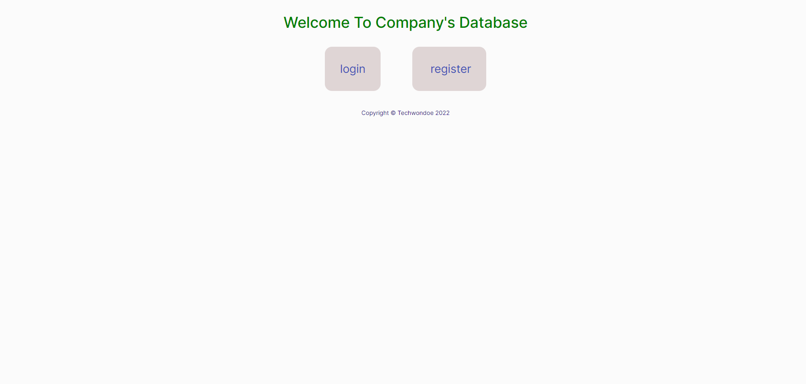
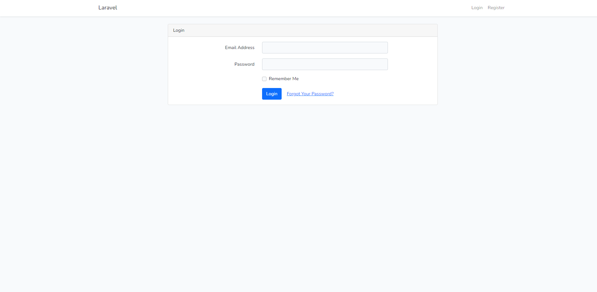
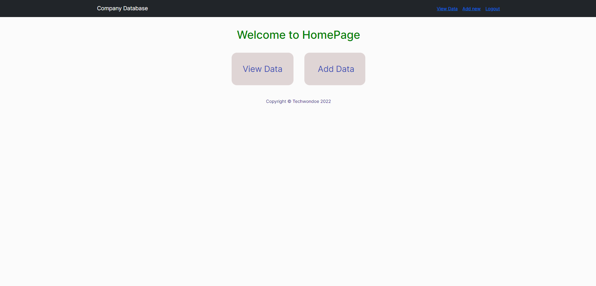
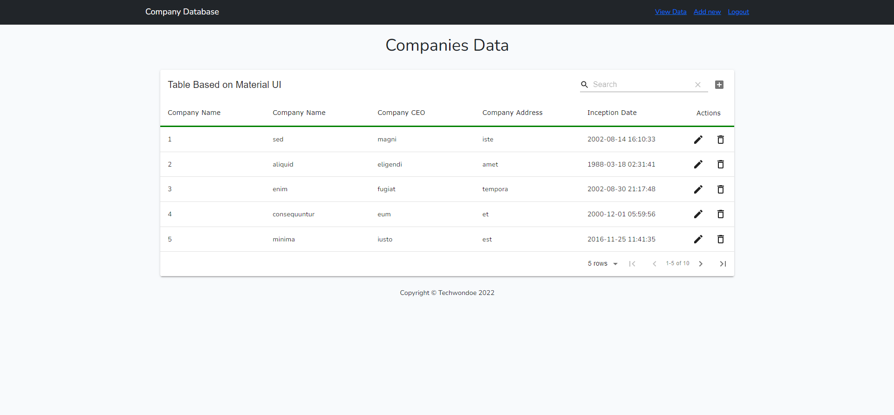
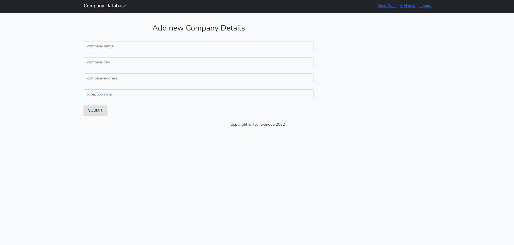

# laravel-react-crud

# setup steps
1. Clone the repository
2. Install composer dependencies using composer install
3. Once you have installed the dependencies, you need to create the .env file. You can copy the example file using this command cp .env.example .env
4. After you have created you .env file you need to generate the application key by running this command php artisan key:generate
5. Create a new mysql database and add the details of your MySQL server in the .env file.
6. Once the database connection is ready, you need to run the migrations using the following command php artisan migrate --seed
7. then run npm install
8. then run npm run dev it will build all the files 
9. lastly run php artisan serve, to start the application
10. create your account, login with that and you are ready to use the application
11. either you can directly login with email=test@example.com and password=password

# checklist
- [x] done

# ScreenShots

